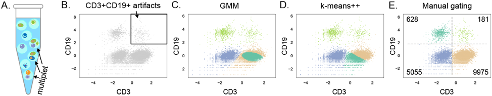
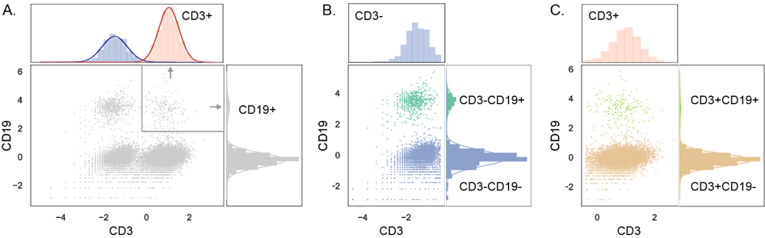

# CITE-sort

CITE-sort is an interpretable clustering framework for CITE-seq datasets based on recursive Gaussian Mixture Model. 

## Description

CITE-sort conducts auto-gating with CITE-seq ADT data. It is robust against artificial cell types that stem from multiplets. CITE-sort also generates biologically meaningful interpretations to its clustering results by constructing a Single Cell Taxonomy tree (Below shows an eaxmple result).

We call cell types that truly exist as *biological cell types* (BCT) and cell types created by CITE-seq multiplets as *artificial cell types* (ACT).   ACTs induce high imbalance of both cluster sizes and clustering coefficients. It seriously influence the performance and efficienty of in clustering. 

CITE-sort addresses this problem by transforming the original high-dimensional, highly imbalanced, many-class clustering problem into solving multiple low-dimensional, fewer-class clustering sub-problems.   

## Usage

### Input

The input of CITE-sort should be a .csv file with CLR normalized CITE-seq ADT data (row: droplet/sample, col: ADT/feature). 

### Run

`python CITEsort.py ADT_clr_file -c 0.1 -o ./CITEsort_out`

- -c, cutoff, the similarity threshold of merging Gaussian components; the default is 0.1. It should be a real value between 0 and 1. The bigger value leads to split more aggressively, and ends in a more complicated tree.
- -o, output, the path to save ouput files. If not specified, CITE-sort will create a folder "./CITEsort_out" in the current directory.

### Outputs

- tree.pdf, the vasualized Single Cell Taxonomy tree of input dataset created by CITE-sort.
- leaf_labels.csv, the labels of each droplets in Single Cell Taxonomy tree.
- tree.pickle, the tree structure recording the main clusteirng infromation of input dataset.
- tree.dot, the auxiliary file to plot the tree.

## Examples

We provide four ADT datasets with CLR normalization from 10x:

- [10k PBMCs from a healthy donor](https://support.10xgenomics.com/single-cell-gene-expression/datasets/3.0.0/pbmc_10k_protein_v3) 
- [10k cells from a MALT tumor](https://support.10xgenomics.com/single-cell-gene-expression/datasets/3.0.0/malt_10k_protein_v3)
- [5k PBMCs from a healthy donor (next GEM)](https://support.10xgenomics.com/single-cell-gene-expression/datasets/3.0.2/5k_pbmc_protein_v3_nextgem)
- [5k PBMCs from a healthy donor (v3 chemistry)](https://support.10xgenomics.com/single-cell-gene-expression/datasets/3.0.2/5k_pbmc_protein_v3)

We show the Single Cell Taxonomy tree The 10k PBMCs after running CITE-sort with default parameters. 

### Example Commond

The 10k PBMCs ADT dataset is used as example. 

`python CITEsort.py ./data_10x/ADT_10k_PBMC_normalized.csv -o ./10x_10k_PBMC `

## Authors

Qiuyu Lian\*, Hongyi Xin\*, Jianzhu Ma, Yanda Li, Liza Konnikova, Wei Chen\#, Jin Gu\#,Kong Chen\#

## Maintainer

Qiuyu Lian, Hongyi Xin.

