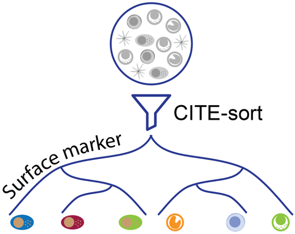
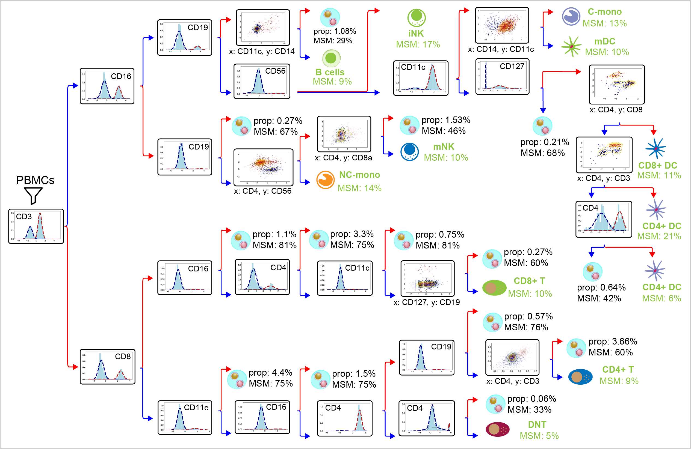

# CITE-sort

An artificial-cell-type aware surface marker clustering method for CITE-seq data. 

  

## Description

CITE-sort conducts auto-gating with CITE-seq ADT data using recursive Gaussian Mixture Model. It is robust against artificial cell types that stem from multiplets. CITE-sort also provides concrete explanations of its internal decision process by constructing a biologically meaningful sort tree.  See our [paper](https://academic.oup.com/bioinformatics/article/36/Supplement_1/i542/5870491) for more details. 

Below shows an example of sort tree constructed by CITE-sort from an in-house PBMC dataset. Each node represents a subpopulation. The title of each inner node represents the selected surface markers subspace. Red and blue colors represent the two component complexes for subdivision. Edges are colored according to their corresponding component complexes. Leaf nodes are hand-curated and are annotated with domain knowledge. Cell types that should not exist are labeled as suspect _artificial cell type_ (ACT) clusters. Suspect ACT clusters are characterized by their population percentages in the overall dataset (denoted by ‘prop’) and their multi-sample multiplets percentages (denoted by ‘MSM’). Abbreviations: iNK: intermediate NK cells; mNK: vast majority of NK cells; C-mono: classical monocytes; NC-mono: non-classical monocytes; mDC: myeloid DC; DNT: double negative T cells.

## Usage

### Input

The input of CITE-sort should be a csv file with CLR normalized CITE-seq ADT data (row: droplet/sample, col: ADT/feature). 

### Run

`python runCITEsort.py ADT_clr_file -c 0.1 -o ./CITEsort_out`

- -c, cutoff, the similarity threshold of merging Gaussian components; the default is 0.1. It should be a real value between 0 and 1. The bigger value leads to split more aggressively, and ends in a more complicated tree.
- -o, output, the path to save ouput files. If not specified, CITE-sort will create a folder "./CITEsort_out" in the current directory.

`python runCITEsort.py ADT_clr_file -c 0.1 -o ./CITEsort_out --compact`

- --compact, adding this parameter will output a compact tree. 

See analysis [tutorial](https://github.com/QiuyuLian/CITE-sort/blob/master/AnalysisTutorial.ipynb) for visualizing each node.  

### Outputs

- tree.pdf, the vasualized sort tree of input dataset created by CITE-sort.
  - There are three rows in each inner node:
    - "**n_marker(s)**": **n** is the node ID, which is obtained by Breath First Search. **marker(s)**, the surface markers next to the ID, is the subspace selected to subdivide the current population.
    - "**Num: xxx**": is the number of droplets in current population.
    - "**(a|b)**": **b** denotes the number of components determined by BIC in the selected surface marker subspace. **a** denotes the number of component-complexes after merging with a certain threshold. Generally, **a** <= **b**. **a** = **b** when all components can not be merged with current threshold.
  - The numbers next to the arrows denote the mean of the selected markers in the partition the arrow stands for. In leaf nodes, the means of all markers are marked if not using '--compact'. As CITE-sort takes CLR-format values as input, these numbers could be positive or negative. 
- leaf_labels.csv, the labels of each droplets in the sort tree.
- tree.pickle, the tree structure recording the main clusteirng infromation of input dataset.
- tree.dot, the auxiliary file to plot the tree.

## Examples

We provide 3 in-house and 5 public CITE-seq datasets in "./datasets":

- [PBMC_1k (10X Genomics)](https://support.10xgenomics.com/single-cell-gene-expression/datasets/3.0.0/pbmc_1k_protein_v3)
- [PBMC_1k_b (In house)](https://github.com/QiuyuLian/CITE-sort/tree/master/datasets)
- [PBMC_2k (In house)](https://github.com/QiuyuLian/CITE-sort/tree/master/datasets)
- [PBMC_5k (10X Genomics)](https://support.10xgenomics.com/single-cell-gene-expression/datasets/3.0.2/5k_pbmc_protein_v3)
- [PBMC_8k (10X Genomics)](https://support.10xgenomics.com/single-cell-gene-expression/datasets/3.0.0/pbmc_10k_protein_v3) 
- [MALT_8k (10X Genomics)](https://support.10xgenomics.com/single-cell-gene-expression/datasets/3.0.0/malt_10k_protein_v3)
- [CBMC_8k (GSE100866)](https://www.ncbi.nlm.nih.gov/geo/query/acc.cgi?acc=GSE100866)
- [PBMC_16k (with cell hashing) (In house)](https://github.com/QiuyuLian/CITE-sort/tree/master/datasets)

### Example Commond

**Example 1**: The PBMC_2k dataset is used as an example of beginning with CLR-format data.

`python preCITEsort.py ./datasets/PBMC_2k_ADT_clr.csv `

- plot histgram of each marker.

`python runCITEsort.py ./datasets/PBMC_2k_ADT_clr.csv `

- run CITE-sort and output a sort tree.

**Example 2**: ADTs from [GSE143363](https://github.com/QiuyuLian/CITE-sort/blob/master/datasets) are extracted from [GEO](https://www.ncbi.nlm.nih.gov/geo/query/acc.cgi?acc=GSE143363) and used as an example of begining with  raw counts.

`python preCITEsort.py ./datasets/GSE143363_ADT_Dx_count.csv --CLR `

- transform data into CLR format and plot histgram of each marker.

`python runCITEsort.py ./CITEsort_out/data_clr.csv --compact`

- run CITE-sort and output a sort tree in compact way.

## Authors

Qiuyu Lian\*, Hongyi Xin\*, Jianzhu Ma, Liza Konnikova, Wei Chen\#, Jin Gu\#,Kong Chen\#

## Maintainer

Qiuyu Lian, Hongyi Xin.

